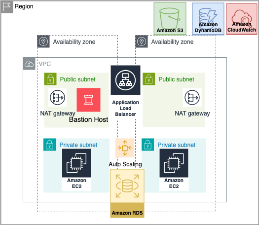

# Terraform AWS VPC Infrastructure

This repository contains a fully featured, high-availability AWS VPC infrastructure setup using Terraform. The project is modular and production-ready, following best practices like remote state management, state locking, and multi-AZ deployment.

## Project Structure

project-root/
- terraform-backend-setup/
  - main.tf       # backend config (S3 + DynamoDB)
- terraform_vpc_project/
  - backend-config.tf
  - main.tf
  - subnet.tf
  - security.tf
  - resources.tf

## Features

- Custom VPC with public and private subnets across **two Availability Zones** (e.g., us-east-1a & us-east-1b)
- Internet Gateway and dual NAT Gateways for high availability
- Route Tables with proper associations
- Security Groups for:
  - Bastion Host (SSH only from your IP)
  - Load Balancer (HTTP/HTTPS from the internet)
  - EC2 Instances (access via Bastion and Load Balancer)
  - RDS (MySQL access restricted to EC2 instances only)
- **Remote backend**:
  - S3 bucket with versioning for Terraform state
  - DynamoDB table for state locking
- **Application Load Balancer (ALB)** to distribute HTTP traffic
- **Auto Scaling Group (ASG)** with Launch Template
- **CloudWatch Alarms** to trigger scaling policies based on CPU usage
- **SSH access** via Bastion Host to private EC2 instances
- **RDS (MySQL)** hosted in private subnets

# Infrastructure & Contributions

“Infrastructure as Code implemented using Terraform with guidance; VPC, subnets, security groups, and high-availability architecture fully designed and configured.”

## Testing and Validation

For detailed testing instructions including SSH access, ALB routing, autoscaling, and RDS connectivity, see [test.md](test.md).  

## 📸 Architecture Diagram



## Prerequisites

- [Terraform CLI](https://www.terraform.io/downloads) ≥ 1.3
- AWS CLI configured with IAM credentials (`aws configure`)
- AWS account with permissions to create:
  - VPC, EC2, S3, DynamoDB, NAT Gateway, Internet Gateway, Elastic IPs, etc.

## How to Deploy

### 1️⃣ Deploy the Remote Backend (once)
```bash
cd terraform-backend-setup/
terraform init
terraform apply
```
This will create the S3 bucket and DynamoDB table used to store and lock the Terraform state.

2️⃣ Deploy the Main Infrastructure
```bash
cd ../terraform_vpc_project/
terraform init        # Connects to the remote backend
terraform plan        # Review execution plan
terraform apply       # Deploy infrastructure
```
💡 Note: Update your public IP in security.tf to restrict SSH access to the Bastion Host:


cidr_blocks = ["YOUR.PUBLIC.IP/32"]
📤 Outputs
Optional outputs can be defined in outputs.tf, e.g.:

```hcl
output "vpc_id" {
  value = aws_vpc.main.id
}

output "public_subnet_ids" {
  value = [aws_subnet.public_subnet_1.id, aws_subnet.public_subnet_2.id]
}
```
📜 License
This project is licensed under the MIT License. Feel free to use, modify, and share.

📬 Contact
For questions, suggestions, or issues, open an issue or pull request on this repository.
